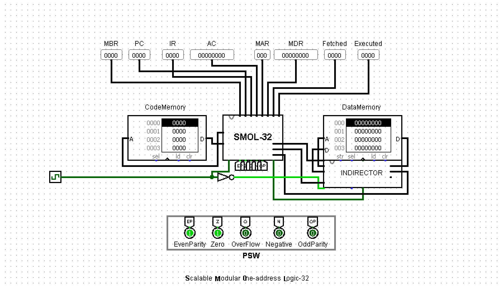
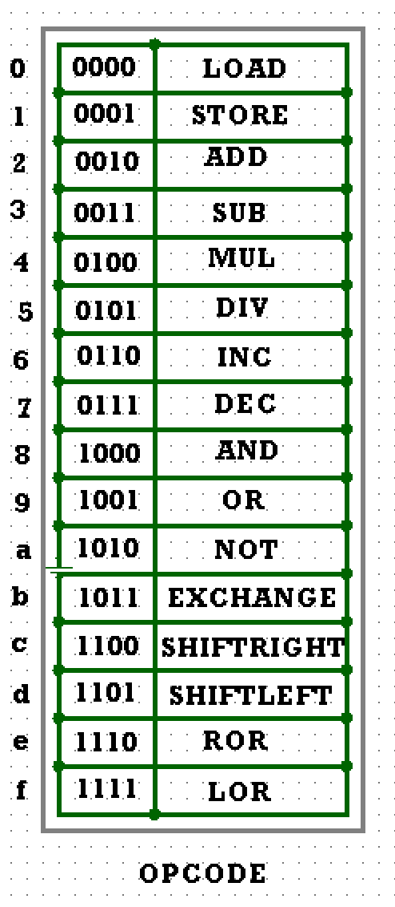

# SMOL-32-A-One-Address-Indirect-Addressing-Mode-32-Bit-Processor
Scalable Modular One-address Logic-32 or SMOL-32 is a Processor designed on Logisim v2.7

Instruction format:
First 3 bits specify address _ _ _ _ last bit specifies opcode

Preview.

OpCode Table

